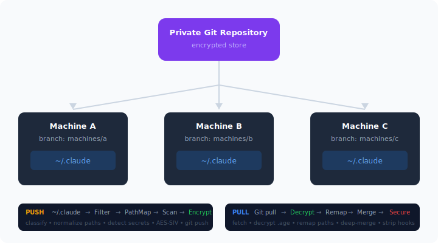

<p align="center">
  
  
  
  
  
</p>

<p align="center">
  
</p>

<h1 align="center">claudefy</h1>

<p align="center">
  <strong>Sync your Claude Code environment across every machine you work on.</strong><br/>
  Git-backed &bull; Encrypted &bull; Automatic
</p>

---

claudefy keeps your `~/.claude` directory — CLAUDE.md, MEMORY.md, commands, skills, agents, hooks, rules, plans, plugins, settings, and project configs — in sync across all your machines through a private git repository. It also selectively syncs MCP server configurations from `~/.claude.json`. It encrypts sensitive content with AES-256-SIV, normalizes machine-specific paths, deep-merges settings, and can run fully automatically via Claude Code hooks.

## Why claudefy?

- **One config, every machine.** Stop manually copying files between your laptop, desktop, and servers.
- **Safe by design.** Credentials never leave your machine. Secrets are detected and encrypted before push. Remote hooks are stripped on pull to prevent injection.
- **Set it and forget it.** With auto-sync hooks, `pull` runs when Claude Code starts and `push` runs when it ends. No manual steps.
- **Conflict-free.** Per-machine git branches prevent collisions. Deep merge resolves settings.json at the key level, preserving local permission rules.
- **Preview before you sync.** `claudefy diff` shows exactly what would change. `--dry-run` on push/pull lets you verify before committing.

## Quick Start

**Install:**

```bash
npm install -g @kodrunhq/claudefy
```

**First machine — initialize:**

```bash
# Point to an existing private repo
claudefy init --backend git@github.com:you/claude-sync.git --hooks

# Or auto-create a GitHub repo
claudefy init --create-repo --hooks
```

**Other machines — join:**

```bash
claudefy join --backend git@github.com:you/claude-sync.git --hooks
```

That's it. With `--hooks`, sync is automatic from now on.

**Manual sync (if you skip hooks):**

```bash
claudefy push     # push local changes
claudefy pull     # pull remote changes
claudefy status   # see what would sync
claudefy diff     # preview what push/pull would change
```

## How It Works

<p align="center">
  
</p>

Each machine gets its own git branch (`machines/<id>`). Push merges into `main`; pull merges `main` back into the machine branch. No conflicts, no data loss.

## What Gets Synced

| | Items | Notes |
|---|-------|-------|
| **Always synced** | CLAUDE.md, MEMORY.md, commands, agents, skills, hooks, rules, plans, plugins, agent-memory, projects, settings.json, history.jsonl, package.json | Core config that travels with you |
| **Selectively synced** | `~/.claude.json` mcpServers (opt-in), theme, notification preferences | Requires `claudeJson.syncMcpServers: true` for MCP servers |
| **Never synced** | cache, backups, file-history, shell-snapshots, paste-cache, session-env, tasks, .credentials.json, settings.local.json, statsig, telemetry, ide, debug, todos, stats-cache.json | Machine-local, ephemeral, or sensitive |
| **Unknown** | Anything else | Synced to separate dir, always encrypted when encryption is enabled |

> **Note:** `settings.local.json` is hardcoded as never-synced — it cannot be overridden even with a custom allowlist. This follows Claude Code's `.local.` convention for non-shared files.

## Commands

### Core

| Command | Description |
|---------|-------------|
| `claudefy init --backend <url>` | Initialize on the first machine |
| `claudefy join --backend <url>` | Join from another machine |
| `claudefy push` | Push local changes to remote |
| `claudefy pull` | Pull remote changes to local |
| `claudefy diff` | Preview what push/pull would change |
| `claudefy override --confirm` | Wipe remote, push local as source of truth |
| `claudefy status` | Show file classification |

### Project Links

| Command | Description |
|---------|-------------|
| `claudefy link <alias> <path>` | Map a local project path to a portable ID |
| `claudefy unlink <alias>` | Remove a mapping |
| `claudefy links` | List all mappings |

### Management

| Command | Description |
|---------|-------------|
| `claudefy hooks install` | Install auto-sync hooks |
| `claudefy hooks remove` | Remove auto-sync hooks |
| `claudefy machines` | List registered machines |
| `claudefy restore` | Restore from a backup |
| `claudefy doctor` | Diagnose sync health |
| `claudefy config get/set` | View or update config (with schema validation) |
| `claudefy logs` | Show recent sync operations |
| `claudefy export --output <path>` | Create a portable backup archive |
| `claudefy rotate-passphrase` | Re-encrypt all files with a new passphrase |
| `claudefy uninstall` | Remove claudefy hooks, config, and store |
| `claudefy completion` | Output bash/zsh/fish shell completion scripts |

### Push/Pull Options

| Option | Description |
|--------|-------------|
| `-q, --quiet` | Suppress output |
| `--skip-encryption` | Skip encryption (testing only, prints warning) |
| `--skip-secret-scan` | Skip secret scanning on push |
| `--dry-run` | Preview changes without writing |
| `--only <item>` | Sync only a specific item (e.g., `--only commands`) |
| `--force` | Push: skip pull-before-push step |

## Encryption

claudefy uses **AES-256-SIV** deterministic encryption via `@noble/ciphers`.

- **Deterministic** — same plaintext always produces the same ciphertext, so unchanged files produce zero git diff.
- **JSONL files** — encrypted line-by-line, preserving git's ability to diff and merge individual lines.
- **Other files** — encrypted as whole files.
- **Key derivation** — PBKDF2-SHA256 with 600,000 iterations. Salt is derived from the backend URL, so SSH and HTTPS URLs for the same repo produce the same key.

### Encryption modes

| Mode | Behavior |
|------|----------|
| `reactive` (default) | Only files where the secret scanner detects a match are encrypted. Unknown-tier files are always encrypted. Clean allowlisted files stay in plaintext. |
| `full` | All files are encrypted regardless of scanner results. Maximum security, larger git diffs. |

Set mode: `claudefy config set encryption.mode full`

**Passphrase resolution order:**
1. `CLAUDEFY_PASSPHRASE` environment variable (recommended)
2. OS keychain (if configured)

Interactive prompts occur during `claudefy init`, `claudefy join`, `claudefy rotate-passphrase`, and `claudefy uninstall` (unless `--confirm` is passed).

> See [docs/encryption.md](docs/encryption.md) for the full technical deep-dive.

## Security

- `.credentials.json` and `settings.local.json` are **never** synced (hardcoded deny, cannot be overridden).
- Remote `hooks`, `mcpServers`, `env`, `permissions`, `allowedTools`, and `apiKeyHelper` keys are **stripped** from settings.json on pull — prevents code injection from the remote.
- MCP server sync via `~/.claude.json` requires explicit opt-in (`syncMcpServers: true`). Server commands are validated for shell metacharacters and args are checked for injection patterns.
- Path traversal protection on `@@HOME@@` sentinel expansion — resolved paths must stay within the home directory.
- Secret scanner checks 15 built-in patterns (API keys, tokens, credentials) before push, plus user-defined custom patterns. Secrets trigger encryption; if encryption is disabled, the push is blocked.
- Symlinks are skipped during sync and diff operations to prevent path traversal.
- Concurrent operations are protected by a PID-based lockfile with 10-minute timeout.
- Passphrases are never stored in plaintext on disk.

> See [docs/security.md](docs/security.md) for the full security model.

## Configuration

Config lives at `~/.claudefy/config.json`:

```json
{
  "version": 1,
  "backend": { "type": "git", "url": "git@github.com:you/claude-sync.git" },
  "encryption": { "enabled": true, "useKeychain": false, "cacheDuration": "0", "mode": "reactive" },
  "claudeJson": { "sync": true, "syncMcpServers": false },
  "secretScanner": { "customPatterns": [] },
  "backups": { "maxCount": 10, "maxAgeDays": 30 },
  "machineId": "hostname-abc12345"
}
```

### Custom secret patterns

Add patterns to detect organization-specific secrets:

```bash
claudefy config set secretScanner.customPatterns '[{"name":"Internal Token","regex":"MYCO_[A-Za-z0-9]{32}"}]'
```

## Documentation

| Document | Description |
|----------|-------------|
| [Architecture](docs/architecture.md) | System design, module map, data flows |
| [Encryption](docs/encryption.md) | AES-SIV, PBKDF2, line-level encryption |
| [Security](docs/security.md) | Threat model, hook stripping, secret scanning |
| [Hooks & Auto-Sync](docs/hooks.md) | SessionStart/SessionEnd hooks, automatic sync |
| [Override & Restore](docs/override-and-restore.md) | Override flow, backup system, restore |
| [Path Mapping](docs/path-mapping.md) | Cross-machine path normalization |

## Multi-Machine Workflow

1. **First machine:** `claudefy init --backend <url> --hooks`
2. **Other machines:** `claudefy join --backend <url> --hooks`
3. **Auto-sync:** hooks handle push/pull at session boundaries
4. **Preview changes:** `claudefy diff` to see pending changes
5. **Override:** `claudefy override --confirm` when one machine should be the source of truth (other machines auto-detect and create a backup before applying)

## Contributing

```bash
git clone https://github.com/kodrunhq/claudefy.git
cd claudefy
npm install
npm run lint && npm run format:check && npm run build && npm test
```

## License

[MIT](LICENSE)
